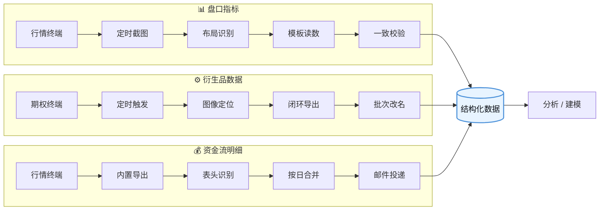
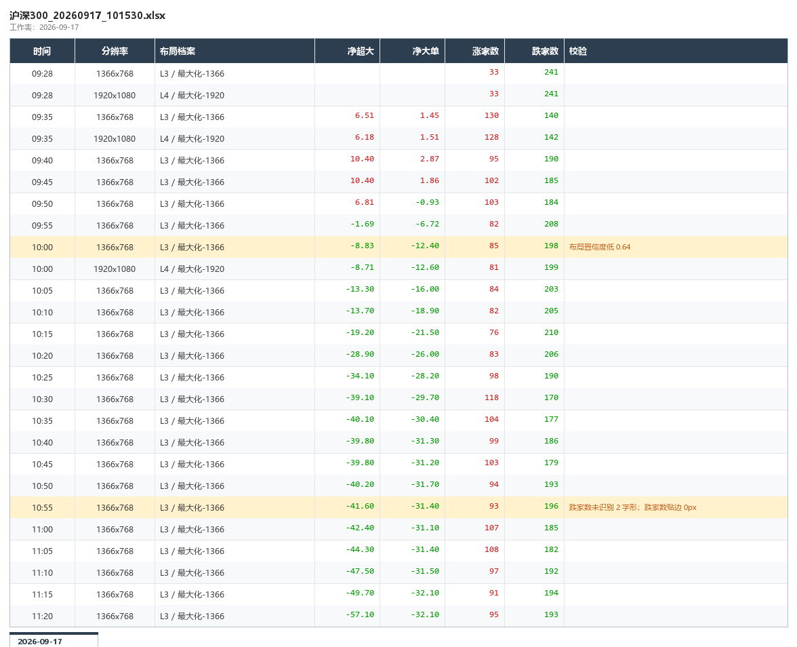

# 金融数据采集自动化

**把手工盯盘取数，变成开机自动跑。**

三条无人值守采集流水线 · 日均 74 个采集时点 · 单批次处理 662 张截图

`Python 3.11` · `RPA` · `PyAutoGUI` · `OpenPyXL` · `Pillow / NumPy` · `PyInstaller`

---

## 三条流水线

**📊 盘口指标** —— 每天自动盯盘 49 次，记下涨跌家数与资金流向

**⚙️ 衍生品数据** —— 每天自动导出 7 次，沪 / 深 / 中金所三大板块全部期权数据

**💰 资金流明细** —— 每天自动整理 18 次，导出、合并后邮件送达

> 每天共 **74 个采集时点**，全部无人值守，输出可直接用于分析建模。

---

## 结构图

**三条线共享同一套设计哲学**：不依赖界面结构、不假设坐标稳定、**宁可报错跳过，也绝不返回一个看起来合理的错数字**。

---

## 📊 盘口指标提取

每日 49 个时点 · 涨家数 / 跌家数 / 净超大单 / 净大单 · 单文件 exe 双击即跑

**技术路线的两次转向**：

| 版本 | 方案 | 结果 |
|:--:|---|---|
| v1 | 截图 + 通用 OCR 引擎识别固定区域 | ❌ **核心字段全部识别失败** |
| **v2** | **点阵模板匹配（彻底放弃 OCR）+ 布局指纹 + 单文件 exe** | ✅ **单日 49/49 全部成功，0 告警** |

<b>ⓘ 展开：为什么放弃 OCR</b>

终端数字用的是**固定点阵字体**——49 张截图里 **726 个字符实例，一个不差地落进 12 种像素图案**（`0-9` + `.` + `-`）。

匹配只有「中」和「不中」，**根本不存在「识别率」这回事**；同时彻底摆脱了 OCR 引擎的安装与版本兼容问题，运行依赖从 4 个减到 3 个，且全是纯 Python 包。

<b>ⓘ 展开：7 个核心难点与破局</b>

| 难点 | 现象 | 破局方案 |
|---|---|---|
| **旧方案大面积失败** | 图上明明是 `-19.2 / -28.9 / -40.1`，输出却是 `空 / -7 / -7` | 逐行统计目标区域的彩色像素，定位根因：**框内混进了整条进度条和分隔线**（14 行实心色块 / 满宽实线），单行文本模式处理「数字 + 实心方块」必然出错 |
| **静默错误：把 `8` 认成 `6`** | 某字段 5 行输出 `-26.2`，真值是 `-28.2`。夹在当天 -21 ~ -34 之间，**看起来完全合理** | 全列对拍才暴露。改模板匹配后归零——这类错误会**无声污染数据集**，比报错危险得多 |
| **坐标每天开盘都在漂** | 09:35~09:50 数字在相对 y=21，其余 45 帧在 y=4，**垂直跳 17 像素**（开盘头 20 分钟进度条未绘制，布局不同） | ① 读取区域自动**上下外扩** ② **分行处理**（多行时只取数字最多的那行，绝不跨行拼接）③ **贴边告警** |
| **静默错误：整位丢失** | 字形**整体滑出读取范围**时，剩下的片段**仍是完整合法数字**（`198` → `98`），程序无依据判断「该有 3 位」 | 单帧无解，改靠**跨帧一致性约束**：跳变检测 + 符号×颜色一致性（绿字必须为负） |
| **语义绑定无法验证** | 「这个区域是涨家数还是跌家数」全靠人工指定，整排漂移会导致**整列张冠李戴**且无声 | ① **颜色语义校验**（涨家数必红、跌家数必绿）② 左右顺序自检 ③ **校准工具拖完框后当场打出四个读数**，让人两秒内确认 |
| **同一分辨率也可能是不同布局** | 同为一种分辨率，一个是最大化、一个是窗口化；用错坐标会读出完全无关的数字 | 改为按**「布局档案」**组织坐标；进一步做**布局指纹**——逐像素中位数求「稳定底图」自动聚类，**662/662 全判对，并自动发现第 4 种布局** |
| **高分屏缩放陷阱** | 真机为 200% 缩放，但系统 API 报告的屏幕尺寸只有实际的一半，坐标体系会整体错位 | 写探针实测物理分辨率与缩放感知级别，确认采集端无问题后再定坐标系 |

### 成果

> 上图为**示意数据**（非真实数据）。重点看两点：
> **① 「布局档案」列** —— 同一批数据里混着不同分辨率与不同窗口布局，被自动识别并分派到各自坐标
> **② 「校验」列 + 黄色高亮** —— 每一行都带独立状态；可疑行自动标黄并写明原因，**不会静默混进正确数据里**

| 指标 | 数值 |
|---|---|
| 单日成功率 | **49 / 49，0 告警** |
| 全量回填 | 8 个交易日 · 662 张截图 → 637 行结构化数据 |
| **数值可信度** | **99.7%** |
| 交付形态 | 单文件 exe（30.8 MB），双击即跑，零 OCR 依赖 |

> 数值可信度口径：逐行自动校验的通过率。唯一例外是一批早期采集，因当天窗口位置被移动导致坐标失效——这类会被系统逐行标记，不会混入数据。

---

## ⚙️ 衍生品全量数据自动导出

每日 7 个时点（09:30 ~ 15:02）· 三大板块全量数据 · 完全无人值守

**交付物**：可一键运行的 RPA 流程（含三市场完整闭环）+ HTML 版操作手册

<b>ⓘ 展开：5 个核心难点与破局</b>

| 难点 | 现象 | 破局方案 |
|---|---|---|
| **自绘界面上元素捕获不适用** | 控件库抓按钮经常点偏，或只能抓到一个巨大的容器面板 | 元素捕获不适用时，改用**图像定位作为兜底**：截取特征图形导入图像库按图案定位。并对关键动作加**超长等待上限**，避免流程因未等到弹窗而中断 |
| **导出弹窗的输入框无法交互** | 清空文本、发送快捷键指令**全部无效** | 放弃在弹窗内输入，改**「先导出默认文件 ➔ 导出结束后统一重命名」** |
| **默认文件名每天都在变** | 导出文件自带日期，写死名字第二天就报「文件不存在」 | ① 扫描目标文件夹 ② 按**创建时间降序** ③ 取**第 0 项**。实现「不管文件名是什么，都取刚生成的那个」 |
| **重命名报非法字符错误** | 路径拼接把引号和运算符写进了文件名 | 定位到 RPA 平台指令的表达式状态缺陷；改为**先设置变量、再传变量**，并强制做字符串类型转换 |
| **流程跑完界面错乱** | 第三个板块跑完后界面停留原地，下一轮触发时**找不到第一个板块的起点** | 加**「终末重置」**动作，把界面强制拉回起始状态，形成闭环 |

> **关键收获**：界面自动化里，**流程必须自己保证终态**——不能假设下一轮开始时界面还在原地。

---

## 💰 个股资金流明细自动归档

每日 18 个时点（09:30~11:30 / 13:00~15:00）· 导出 → 加时间列 → 按日合并 → 邮件投递

<b>ⓘ 展开：5 个核心难点与破局</b>

| 难点 | 现象 | 破局方案 |
|---|---|---|
| **右键菜单坐标不稳定** | 菜单项数量会变（某个选项时有时无），导致目标项 Y 坐标每次偏移 | 改用**键盘导航**：右键 → `End` 到底 → `↑×5` → `→` 展开 → `End`+`↑` → `Enter` |
| **合并时表头结构错乱** | 两类数据一个是单层表头、一个是双层表头；合并后时间列占两行、序号从 2 开始、丢数据 | **自动识别表头行数**（判断首行有无跨列合并），单层从第 2 行读、双层从第 3 行读，并动态插列后重建合并区 |
| **文件被占用导致中断** | 结果文件被表格软件打开时保存失败，整条流水线中断 | 捕获占用异常 → **改存带时分秒的备用文件名** + 日志提醒 |
| **邮件附件中文名变成 `bin`** | 邮箱收到的附件名显示为 `bin` | 用 **RFC 2231** 编码中文名，或输出英文文件名 |
| **打包后缺模块** | 打包产物运行报 `ModuleNotFoundError`；或提示脚本文件不存在 | 固定打包清单：显式声明隐藏导入；必须在脚本所在目录执行打包 |

---

## 跨流水线的共性问题

三条线数据源和技术栈完全不同，**踩的坑却高度同构**——这是本项目最有价值的部分。

| 共性问题 | 📊 盘口 | ⚙️ 衍生品 | 💰 资金流 | **通用解法** |
|---|---|---|---|---|
| **界面结构不可依赖** | 读取区域混入进度条 | 只能抓到巨型容器面板 | 菜单项数量动态变 | **不依赖界面结构**：图像定位 / 键盘导航 / 连通域过滤 |
| **坐标今天对、明天不对** | 数字每天跳 17px | 行情波动导致偏移 | 菜单 Y 每次偏移 | **不留死角**：自动外扩 / 键盘导航 / 布局指纹 |
| **名字和结构每天都在变** | 多种命名 + 多种布局 | 导出名带日期 | 单层/双层表头混用 | **宽松解析 + 自动选取** |
| **静默错误（最危险）** | `8` 认成 `6`、`198` 读成 `98` | 界面错乱找不到起点 | 合并丢数据、序号错位 | **让错误响亮**：逐行标黄 / 跳变检测 / 拒绝退回错误配置 |
| **文件被占用导致中断** | — | — | 表格软件占着结果文件 | **兜底改名**：存带时间戳副本 + 日志提醒 |
| **定时任务不可靠** | 需固定 49 个时点 | 系统任务计划/批处理全部失效 | 手动执行与定时冲突 | **用可靠触发源**：平台自带触发器 / 参数分流 |
| **无法真正后台运行** | — | 社区版需前台 | 模拟操作必须窗口在前 | **接受限制**：虚拟桌面 / 专用采集机 |

### 沉淀出的五条工程原则

> **1. 先实测，再下结论** —— 文档里的分辨率、我自己的「唯一失效模式」判断、凭直觉的等比缩放假设，**全部被实测推翻**
>
> **2. 响亮失败 ≫ 静默出错** —— 一半的工程量花在「让错误能被发现」上
>
> **3. 单帧发现不了的，靠跨帧约束** —— 没有绝对的校验，只有相对的一致性
>
> **4. 分层解耦** —— 命名解析 / 布局识别 / 数据读取三层各管各的，改一层不影响另外两层
>
> **5. 永远留一个给人肉眼确认的点** —— 再好的自动化也需要可核对性

---

## 环境说明

| 流水线 | 运行环境 |
|---|---|
| 📊 ⚙️ 💰 | Windows · Python 3.11 · Pillow / NumPy / OpenPyXL / PyAutoGUI · 国产 RPA 平台 |

---

## ⚖️ 合规声明

本项目**仅为个人学习与研究用途**，记录的是自动化流程设计与工程实践，特此声明：

- **仅做数据采集**：全流程**不包含任何下单、委托、交易执行**操作，也不接入任何交易通道
- **不披露具体机构与软件名称**：出于合规考虑，所有券商、终端软件名称均已抽象化处理
- **不含任何敏感数据**：仓库内**无实时行情数据、无账号凭据、无个人信息**；示例截图为虚构示意数据
- **不涉及授权规避**：所有操作均在软件**正常提供的功能范围内**完成，未使用任何破解、绕过授权或反编译手段
- **数据来源**：所采集数据均为**公开行情信息**，不涉及任何非公开信息

> 如有侵权或不当之处，请联系删除。
